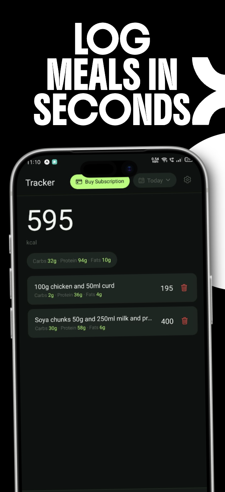
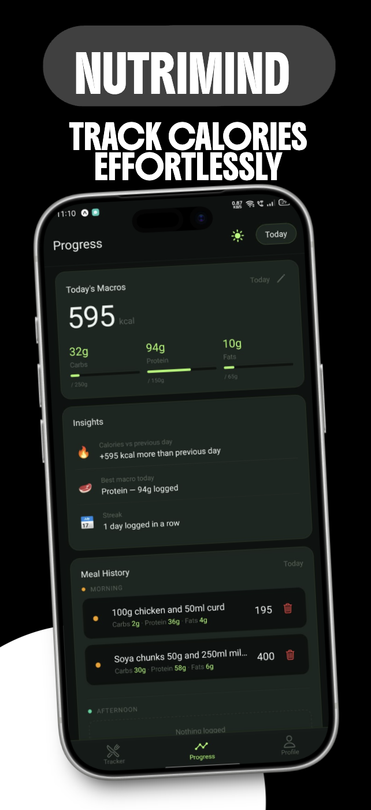
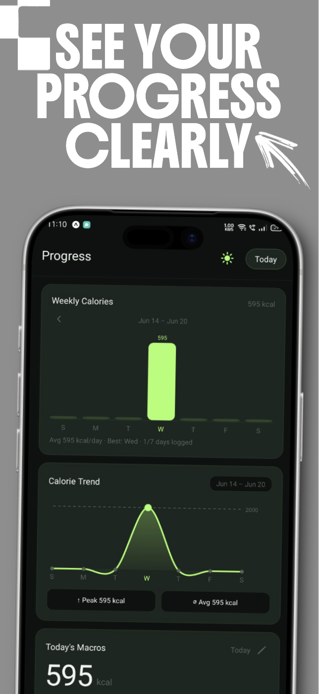
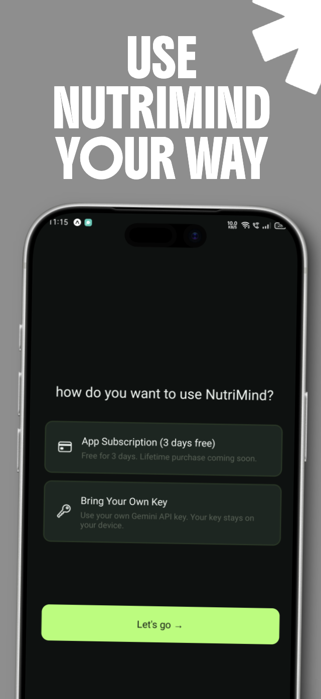

# NutriMind

> AI-powered food tracking — type what you ate or snap a photo, get instant macros.

NutriMind is a cross-platform mobile app (iOS + Android) that uses Gemini AI to analyze your meals from both **text descriptions** and **photos**. Track calories, macros, and progress across days with a clean, native interface.

---

> **🍱 Use this as a SaaS starter.** Everything is managed — database, auth, payments, AI, analytics — all wired up and ready to scale. Fork it, rebrand it, ship your own product.

---

## Preview

| Track meals | Analyze macros | View progress | Customize |
|---|---|---|---|
|  |  |  |  |

## Architecture

```
nutri_mind/
├── application/     — Expo (React Native) mobile app
│   ├── app/         — Expo Router file-based routes
│   ├── components/  — Reusable UI components
│   ├── services/    — API clients & nutrition logic
│   ├── store/       — Zustand state management
│   └── utils/       — Helpers & constants
└── server/          — Next.js backend
    ├── app/         — API routes & pages
    ├── lib/         — Supabase, Razorpay, Gemini clients
    └── supabase/    — Migrations & seed scripts
```

## Setup

### Prerequisites

- Node.js >= 22.13
- iOS: Xcode 26.4+ (for native builds)
- Android: Android Studio (for native builds)
- [Expo CLI](https://docs.expo.dev/more/expo-cli/)

### 1. Clone & install

```sh
cd application && npm install
cd ../server && npm install
```

### 2. Configure environment

```sh
# Mobile app
cp application/.env.example application/.env
# Fill in: API_URL, Supabase creds, Razorpay key, PostHog key, Google OAuth IDs

# Backend
cp server/.env.example server/.env
# Fill in: GEMINI_API_KEY, Supabase creds, Razorpay key/secret
```

### 3. Run

```sh
# Terminal 1 — backend
cd server && npm run dev

# Terminal 2 — mobile app
cd application && npx expo start
```

Scan the QR code with Expo Go, or press `a` (Android) / `i` (iOS) for a development build.

## Key integrations

| Service | Purpose |
|---|---|
| **Gemini AI** | Food recognition & macro estimation from photos |
| **Supabase** | Auth, database, sync |
| **Razorpay** | In-app payments & subscriptions |
| **PostHog** | Product analytics |

## Tech stack

- **Mobile**: Expo SDK 56, React Native 0.85, React 19.2, Expo Router, Zustand
- **Backend**: Next.js 16, Supabase, Gemini AI, Razorpay
- **Language**: TypeScript
